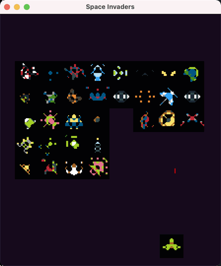
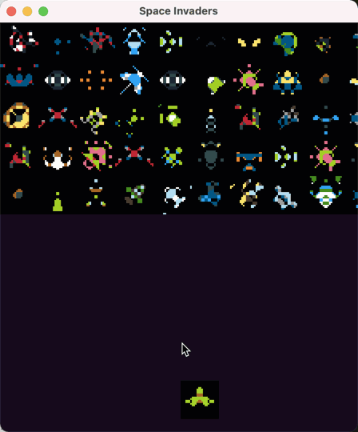

# space invaders

using `love2d` in `lua`

A workthrough of the Harvard CS50 course / twitch stream

https://www.youtube.com/watch?v=jsNqs-QVRxg

## stage 3

timestamp of [stream 2](https://www.youtube.com/watch?v=mr5XNN40JpU): 1h15m, 

- shooting
- collisions working 
- moving aliens

## stage 1

**current state** at twitch stream where projectiles are just about functionals. Getting a bit more modular by breaking things up into `Alien`, `Projectile`, `Ship` and `Util`... etc.

Game logic simple and physics basic (no acceleration, alien movement, collisions..)

## stage 0

getting some awesome 8bit aesthetic from random sprite generator hosted [at this website](http://img.uninhabitant.com/spritegen.html)

