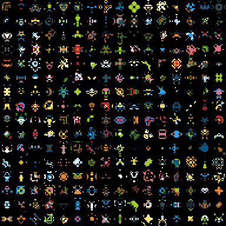

# space invaders

using `love2d` in `lua`

A workthrough of the Harvard CS50 course / twitch stream

**current state**

https://www.youtube.com/watch?v=jsNqs-QVRxg

getting some awesome 8bit aesthetic from random sprite generator

